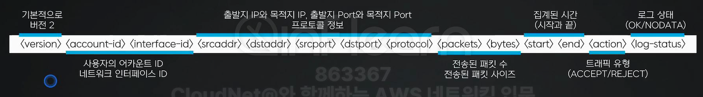
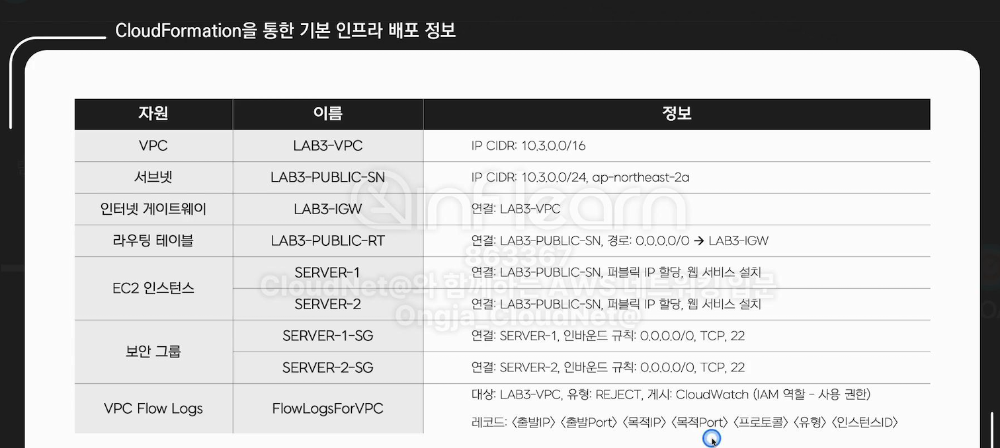
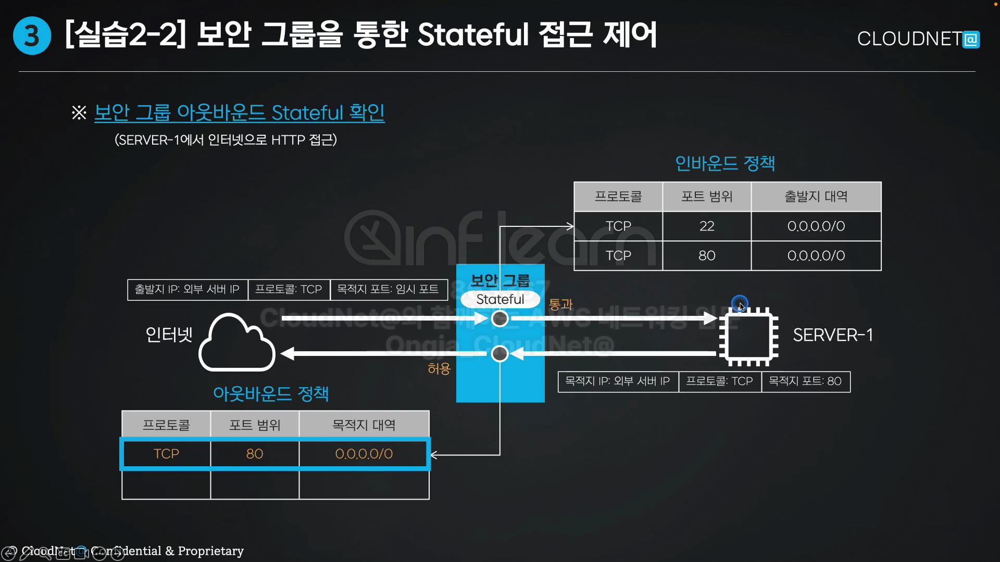

# Chapter_3_Amazon VPC SECURITY

섹션 1

- 네트워크 접근제어
    - 트레픽을 허용하거나 거부하는 접근제어
- 트래픽 흐름의 방향성
    - 네트워크 환경 : 서로 트레픽을 주고받은 형태
    - 접근제어 대상 : 트래픽 방향을 고려한 정책
- 보안그룹과 네트워크 ACL
    - 트래픽 접근제어를 위한 가상의 방화벽 역할
    - 보안그룹 : 서브넷 내에 존재하는 자원들에 대한 접근제어
    - 네워크 ACL : VPC내에 존재하는 서브넷에 대한 접근 제어를 수행
    - 양측 인바운드 아웃바운드 정책을 정함
- 보안그룹의 Stateful 동작
    - 보안그룹이 이전 상태 정보를 기억하고 다음에 그 상태를 활용하는 Stateful
- 네트워크 ACL의 Stateless동작
    - 네트워크 ACL은 이전 상태 정보를 기억하지않아 다음상태에서 활용하지않은 Stateless
- 보안그룹과 네트워크 ACL의 정책 테이블
    - 보안그룹 : 허용 규칙만 나열
        - 정책 테이블에 매칭이 모두 실패시 트래픽거부
    - 네트워크ACL : 허용/ 거부 설정가능
        - 네트워크ACL의 정책 테이블에 마지막 규칙은 모든 트래픽을 거부

---

섹션 2

- Amazon VPC Flow Logs란?
    - VPC에 속한 네트워크 인터페이스에 대한 송수신 트래픽 흐름정보를 수집하는 기능
- Amazon VPC Flow Logs - 레코드
    - 수집하여 표줄하는 정보 형태를 Flow Logs레코드라고 함
        
        
        
- Amazon VPC Flow Logs - 게시 대상
    - VPC Flow Logs를 S3나 CloudWatch로 게시할 때 자격 증명을 부여
- AWS IAM 서비스란?
    - 액세스를 안전하게 관리하도록 인증과 권한을 통제
- Amazon CloudWatch 서비스란?
    - 실시간 로그 및 이벤트 데이터를 수집하고 대시보드에 시각화 하는 모니터링 도구
    - 수집 → 모니터링 → 대응 → 분석
- Amazon VPC Flow Logs 구성
    - 순서도
        - IAM 정책 및 IAM 역할 생성
            - IAM 서비스 → 액세스 관리 → 정책 (메뉴 진입) → 정책 생성 (버튼 클릭)
        - CloudWatch 로그 그룹 생성
            - CloudWatch 서비스 → 로그 → 로그 그룹 (메뉴 진입) → 로그 그룹 생성 (버튼 클릭)
        - Amazon VPC Flow Logs 생성
            - VPC 서비스 →  VPC (메뉴 진입) → 기본 VPC (선택)
        - 인스턴스 생성 및 통신 (로그 확인)
            - EC2 서비스 → 인스턴스 (메뉴 진입) → 인스턴스 시작 (버튼 클릭)
        
- Amazon VPC Flow Logs 삭제
    - 인스턴스 삭제
    - VPC Flow Logs 삭제
    - CloudWatch 로그 그룹 삭제
    - IAM 정책 & 역할 삭제

---

섹션 3

- 실습개요
    - 보안그룹과 네트워크 ACL을 생성하여 동작차이를 이해하고 FlowLogs 레코드 정보 확인
    - 순서도
        - 기본 인프라 생성(CloudFormation 스택 생성)
        - 보안그룹 확인 (Stateful 동작 확인)
        - 네트워크 ACL 확인(Stateless동작 확인)
        - 자원 삭제(CloudFormation 스택 삭제)
- CloudFormation 으로 기본 인프라 배포
    - 템플릿 작성 (다운로드)
    - CloudFormtion 서비스 진입
    - 스택생성(스택이름, 키페어, IAM리소스 생성 승인)
    - 스택생성확인(스택행성확인)
    - 생성된자원확인
        
        
        
- 보안 그룹을 통한 Stateful 접근제어
    - 순서도
        - 아웃바운드 규칙 삭제
        - 인바운드 정책확인
        - 아웃바운드정책확인
        - 인/아웃바운드 정책 수정
            
            
            
- 네트워크 ACL을 통한  Stateless 접근제어
    - 순서도
        - 기본 네트워크 ACL
        - 신규 네트워크 ACL 생성
        - 인바운드 정책확인(기억하고있지않음)
        - 아웃바운드 정책확인(기억하고있지않아서 권한 추가해야함)
    - 인 아웃 독립적이고 기록하고있지않음
- 생성 자원 삭제
    - 네트워크 ACL 삭제
        - 네트워크 ACL 메뉴
        - 네트워크 ACL 선택
        - 서브넷 연결 해제
        - 네트워크 ACL 삭제
        - 삭제 입력
    - CloudWatch 로그 그룹 삭제
        - CloudWatch진입
        - 로그그룹 메뉴 선택
        - 로그그룹 선택
        - 로그그룹 삭제
        - 삭제버튼 클릭
    - CloudFormation 스택 삭제
        - CloudFormation 서비스 진입
        - 스택메뉴 진입
        - 생성한 스택선택
        - 스택삭제
        - 삭제된 자원확인
